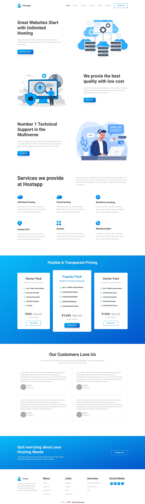

# Hostapp

> Project 11

<table>
<tr>
<td>
  A landing page designed using pure HTML & CSS.
</td>
</tr>
</table>

### Skills Gained from this

- Learned about CSS variables and also CSS Grid(scratched the surface).
- This one took a serious time to build, but it was worth it, with effects upon hover like scale, color change and gradients.
- Also learned about re-using styles.

### Screenshot

## Device support

The site is compatible with desktop/laptop screens only.

## Author

